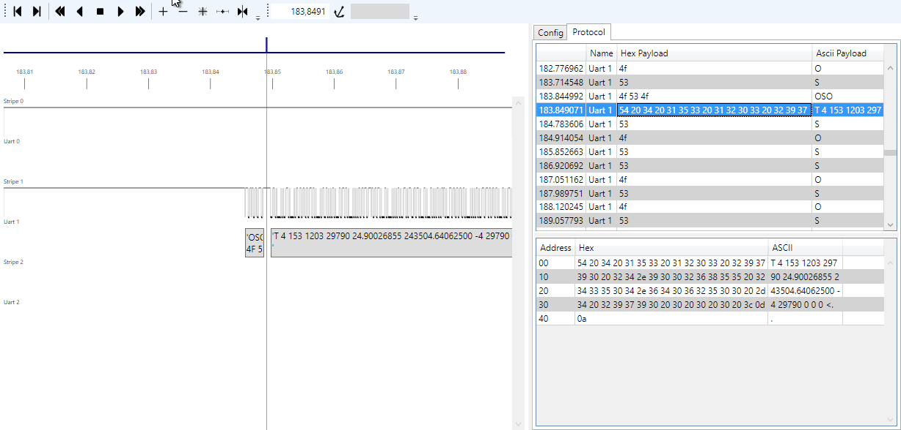

LoStaR
======

LoStaR stands for Logic States Recorder, i.e. a recorder able to save many hours of slow speed logic states to monitor and debug a device featuring relatively
slow speed hardware communication lines or action  lines.

The project is composed by two subprojects

**Capture** - a C console application for linux that samples the digital lines on a parallel port

**lostar** - a WPF application working on Windows only that shows on a timeline the logic states.

Example of LoStaR screen : three serial lines showing the dialog between a measurement board and a PC via s USB/Serial Adapter

The logic analyzer screen to the left is composed by horizontal stripes. Each stripe shows a timeline, i.e. a time evolving signal.
Some stripes represent raw digital levels (e.g. **Stripe 1**), others represent logical information extracted. For instance **Uart 1** interprets the digital signal of the corresponding stripe considering it an asynchronous serial line and shows rectangles with the decoded information.
Planned are additional stripes able to decode additional standards, like I2C.

The cursor (in red) can be moved clicking with the mouse on the desired position or inserting the required time in seconds on the top textbox, left to the anchor icon.

One stripe can be elected to be the current one double clicking on it. Some actions are taken on the current stripe that is identified with a gray caption on screen.

This is the meaning of the tools on the toolbar

* Tools 1 and 2 work only on the current stripe if defined. They move the cursor to the previous or following **important event**. The meaning of **important event** depends on the type of the stripe. If it is a digital stripe, then the cursor is moved to the previous or the following logic transition with respect to the current position of the cursor.
* Tools 3 and 7 scroll to the left and to the right the shown time segment
* Tools 4 and 6 move the cursor
* Tool 5 zooms the shown segment to the whole segment of captured data
* Tools 8 and 9 zoom in and out the shown segment. The same action can be performed with the mouse wheel
* Tool 10 zooms the shown segment to the maximum zoom level (maximum detail)
* Tool 11 works only when the **Anchor** is defined and zooms the shown time segment so as to represent the period of time from the anchor to the cursor to the maximum possible zoom level.
* Tool 12 scrolls the shown segment so that the cursor, which remains in the same absolute position, is shown in the middle of the screen
* TextBox 13 shows the current position of the cursor (in seconds) and accepts a decimal number representing the new position that is accepted when the **Return** key is pressed
* Tool 14 places the anchor where the cursor is. The anchor is a reference time to be taken into account in some activities
* TextBox 15 is enabled only when the anchor is defined and shows the time elapsed in seconds from the anchor to the cursor. It is negative if the cursor is before the anchor.

To the right, the Protocol data grid shows the sequence of meaningful serial data decoded. Selecting each line, the cursor moves to the corresponding transmitted string while the lower pane shows the full content of the transmitted or received string, both in hex and in ASCII.

Installation
============
An automatic installer is planned but still not implemented.

In order to run the current prototype two options are possible.

1. Git Fork the code on a local folder of a PC or download it zipped from GitHub then build it with VisualStudio.
Express 2012 version is the minimum requirement.
2. Download all the content of the `LoStaR/lostar/LoStar/LoStar/bin/Debug` folder on a local folder and launch the LoStar.exe executable (double click on it)